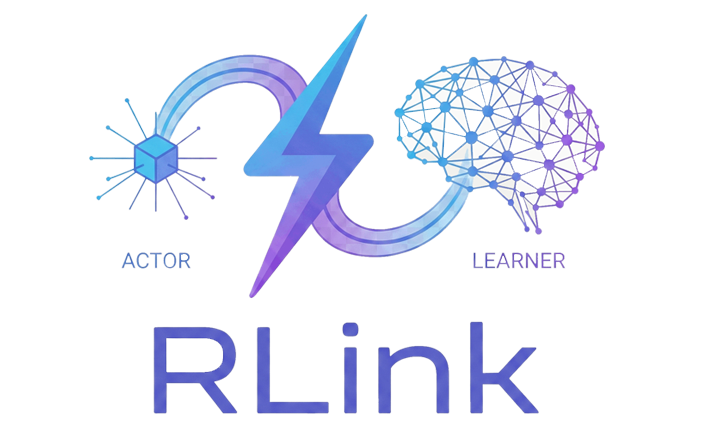

# RLink

<div align="center">
    
</div>

RLink is a lightweight, high-performance communication layer specifically designed for distributed reinforcement learning systems. It enables seamless data exchange between actors (environment interaction) and learners (model training), decoupling sampling from training to scale your RL experiments efficiently.

### ✨ Key Features

🚀 Low-Latency Communication – Optimized for fast transfer of trajectories, actions, observations, and model parameters

📈 Scalability – Supports many-to-one and one-to-many communication patterns for flexible scaling

🔌 Easy Integration – Simple API to connect existing RL frameworks and training pipelines

🌍 Language-Agnostic Design – Currently supports Python with plans for C++/Rust backends

🛡️ Fault-Tolerant – Optional reliability features to handle intermittent connection drops

### 🎯 Why RLink?

Building distributed RL systems often involves complex communication infrastructure. RLink simplifies this by providing a dedicated, optimized layer that:

- Decouples sampling and training processes

- Accelerates experimentation across multiple processes or machines

- Reduces infrastructure overhead

- Enables seamless scaling of actors and learners

### 📊 Architecture Overview

```text
┌─────────────────┐     ┌─────────────────┐     ┌─────────────────┐
│                 │     │                 │     |                 |
│   RL Actors     │────▶│    RLink        │────▶│   RL Learners   │
│  (Sampling)     │◀────│  Communication  │◀────│   (Training)    │
│                 │     │     Layer       │     │                 │
└─────────────────┘     └─────────────────┘     └─────────────────┘
```

### 🚀 Quick Start

Installation
```
bash
pip install rlink
```
Basic Usage

```python
import rlink

# Initialize a learner node
learner = rlink.LearnerNode(port=5555)

# Initialize actor nodes
actor = rlink.ActorNode(learner_address="localhost:5555")

# Send trajectories from actor to learner
trajectory = {"obs": [...], "actions": [...], "rewards": [...]}
actor.send_trajectory(trajectory)

# Receive and process in learner
data = learner.receive()
```

### 🔧 Advanced Configuration

Scaling Actors

```python
# Multiple actors connecting to a single learner
actor1 = rlink.ActorNode(learner_address="localhost:5555")
actor2 = rlink.ActorNode(learner_address="localhost:5555")
actor3 = rlink.ActorNode(learner_address="localhost:5555")
```

Reliable Mode

```python
# Enable fault-tolerant communication
learner = rlink.LearnerNode(
    port=5555,
    reliable=True,
    retry_attempts=3
)
```

### 📚 Use Cases
Distributed RL Training – Scale to hundreds of parallel environments

Multi-Agent Systems – Coordinate communication between agents

Federated RL – Train across distributed data sources

Hybrid Cloud/Edge Training – Deploy actors and learners across different infrastructure

### 🔄 Communication Patterns

|Pattern	|Description	|Use Case|
|---------|-------------|--------|
|Many-to-One |	Multiple actors → Single learner	|Centralized training |
|One-to-Many |  Single learner → Multiple actors	|Parameter distribution |
|Bidirectional |	Two-way communication|	Advanced coordination |

### 🛠️ Integration with Popular Frameworks

### 📈 Performance Benchmarks

### 🔮 Roadmap
C++ backend implementation

Rust backend implementation

WebSocket support for browser-based actors

Advanced load balancing

Protocol buffers serialization

Kubernetes operator for orchestration

### 🤝 Contributing

We welcome contributions! Please see our Contributing Guidelines for details.

Fork the repository

Create a feature branch

Commit your changes

Push to the branch

Open a Pull Request

### 📄 License

RLink is released under the MIT License. See LICENSE for details.

📞 Support & Community

📖 Documentation

🐛 Issue Tracker

💬 Discord Community

🐦 Twitter Updates


